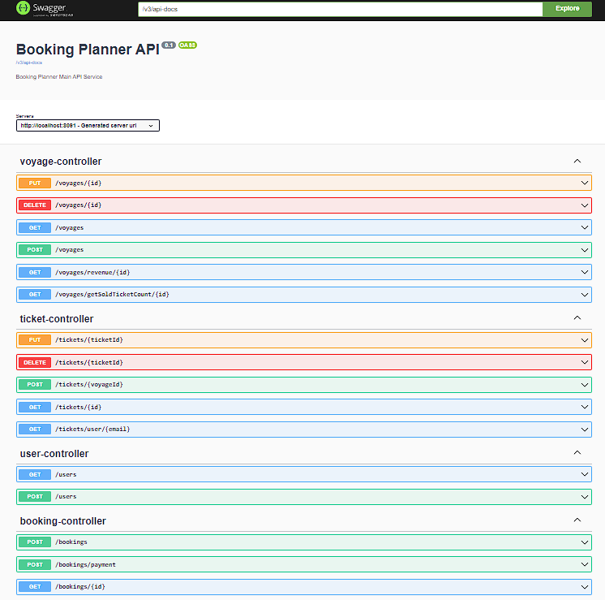

<!-- ABOUT THE PROJECT -->

## Kodluyoruz & Solmaz Java Spring Boot Bootcamp Final Projesi

### Proje hakkında

Proje genel bir bilet alma sistemini simüle etmektedir.

### UML diagram

<!-- TECHNOLOGIES -->

### Kullanılan Teknolojiler

</a>          

   
 
 

<!-- OUTPUT SCREENSHOTS -->

### Çıktı Görüntüleri

## Lisans

MIT Lisansı altında dağıtıma açıktır. Daha fazla bilgi için `LICENSE.txt` dosyasını inceleyebilirsiniz. 
Distributed under the MIT License. See `LICENSE.txt` for more information.

<!-- CONTACT -->

## İletişim

### Sami Sezgin

  

<!-- PROJECT-BOOTCAMP-PRACTICUM PART -->

 

## Java Bootcamp - Kodluyoruz & Solmaz

  

<h3 align="center">Company: Solmaz Gümrük Müşavirliği A.Ş.</h3>

  
<h3 align="center">Organizer: Kodluyoruz.org</h3>

